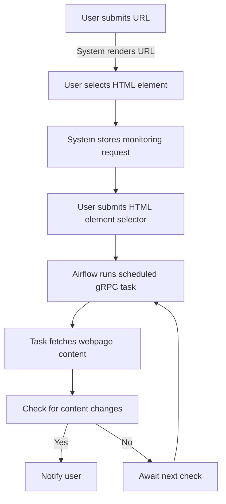

# Delty

Monitor specific HTML sections of a webpage and get notified whenever new changes are
detected.

## How it works

1. The user submits a URL and Delty renders it in the UI.
2. The user selects and submits an HTML element in the webpage that needs to be
   monitored
3. The system periodically checks the selected area and compares its current content
   with the previous content.
4. If any changes are detected, the system notifies the user.

## Technologies used

- **Python**: The primary programming language used throughout the application.
- **Django**: Web framework for the main "Delty" application.
- **Poetry**: Package manager for Python.
- **PostgreSQL**: Database for storing user data and monitoring information.
- **Redis**: In-memory caching storage and message brokering.
- **Airflow**: Orchestrates and schedules periodic tasks for monitoring.
- **gRPC**: Communication medium between Airflow & Delty.
- **Dramatiq**: Asynchronous task queue used for handling background jobs in Delty.
- **Docker & Docker Compose**: Containerization and orchestration of services.

## Setup Instructions

1. **Prerequisites**: **Docker** and **Docker Compose** installed on your machine.
2. **Clone repository**: `$git clone https://github.com/dimitrisor/delty.git`
3. **Setting env vars**: Create a `.env` file in the root directory and populate it with
   the necessary environment variables:
4. **Build and run containers**: `$docker-compose up`

## Using the Application

1. **Access the application**: Open your web browser and navigate to
   `http://localhost:8000` to access the main application.
2. **Enter a URL**: On the main page, enter the URL of the webpage you wish to monitor.
3. **Select an element in the rendered HTML**: The webpage will load in an iframe. Click
   on the specific HTML element you want to monitor.
4. **Submit element selector**: Click the "Crawl" button to submit the area definition.
5. **Receiving notifications (TODO)**: The system checks the selected area at scheduled
   intervals, and notifies the user if any changes are detected

**\*Adjusting Monitoring Intervals**: By default, the system checks for changes every 10
minutes. To adjust the interval, modify the schedule in the Airflow DAG file located at
`airflow/dags/track_content_diff_dag.py`.

## Todos

1. Increase testing coverage over 95%.
2. Send notifications through email.
3. Build a REST API supporting core functionality through CRUD operations.
4. Build a UI using React.js

## Contributing & License

Contributions are welcome! Please open an issue or submit a pull request for any
improvements. This project is licensed under the MIT License - see the
[LICENSE](LICENSE) file for details.
